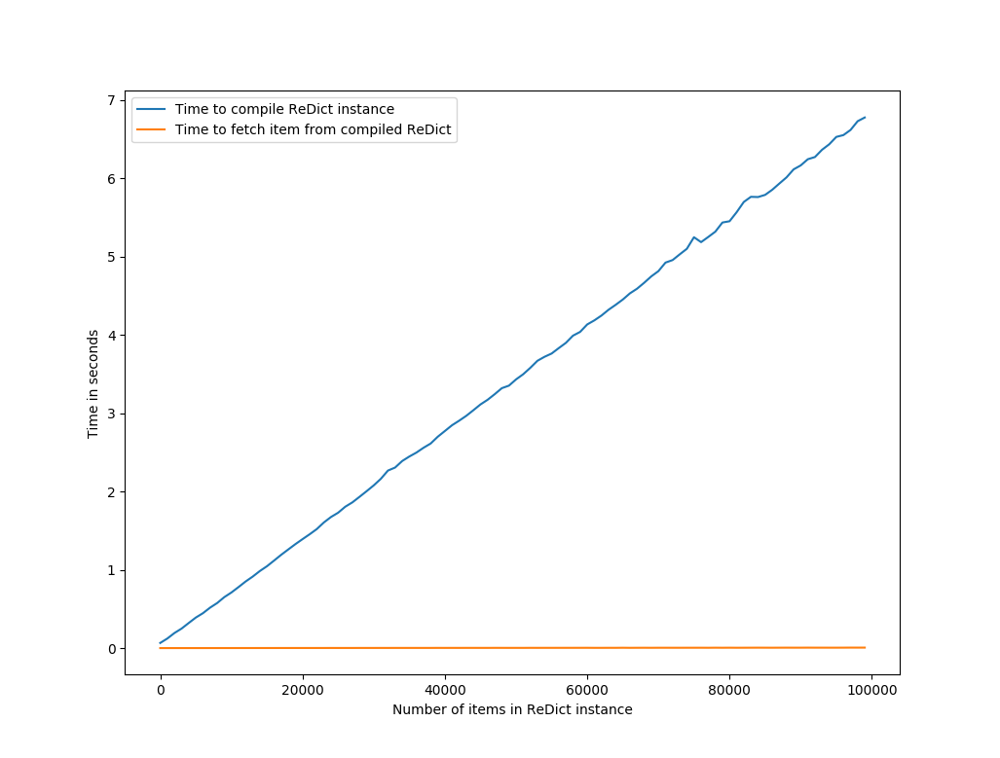
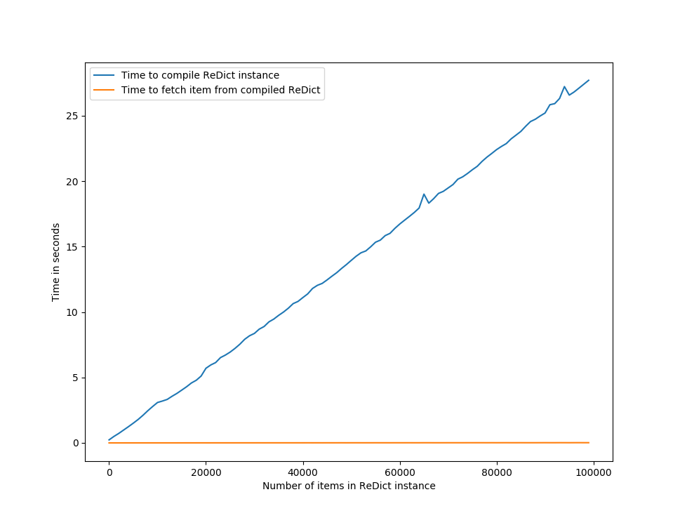

chatbot_utils
=============

.. contents:: Table of Contents

Chatbot utils provides easy-to-use tools for building a chatbot capable of
returning flexible, contextual responses when provided with text input.

By *Contextual responses*, I mean something like this;

::

    human >> hey, what time is it?
      bot >> it's 10.32pm
    human >> is that past my bedtime?
      bot >> no, you're good

The second phrase typed by the human, ``"is that past my bedtime?"``, is
ambiguous, and required the bot to understand that this was an incomplete
question related to the previous question, i.e. the **context**.

Installation
------------

From PyPi
#########

TODO

From Github
###########

#. ``git clone github.com/eriknyquist/chatbot_utils``
#. ``cd chatbot_utils``
#. ``python setup.py build``
#. ``python setup.py install``

Example bot with chatbot_utils
------------------------------

.. code-block:: python

    import random
    import time

    from chatbot_utils.responder import Responder, Context

    random.seed(time.time())

    responder = Responder()

    # Add a context for talking about cats
    cat_context = Context()
    cat_context.add_entry_phrases(
        (["(.* )?(talk about|tell( me)? about) cats?.*"], ["Sure, I love cats"])
    )

    cat_context.add_responses(
        (["(.* )?favou?rite thing about (them|cats?).*"], ["They are fuzzy"]),
        (["(.* )?(do )?you have (one|(a )?cat).*"], ["No, computer programs can't have cats."])
    )

    # Add a context for talking about cats
    dog_context = Context()
    dog_context.add_entry_phrases(
        (["(.* )?(talk about|tell( me)? about) dogs?.*"], ["Sure, I think dogs are great"])
    )

    dog_context.add_responses(
        (["(.* )?favou?rite thing about (them|dogs?).*"], ["They are loyal"]),
        (["(.* )?(do )?you have (one|(a )?dog).*"], ["No, computer programs can't have dogs."])
    )

    responder.add_default_response(["Oh, really?", "Mmhmm.", "Indeed.", "How fascinating."])
    responder.add_responses(
        (["(.* )?hello.*"], ["How do you do?", "Hello!", "Oh, hi."]),
        (["(. *)?(good)?bye.*"], ["Alright then, goodbye.", "See ya.", "Bye."])
    )

    responder.add_contexts(cat_context, dog_context)

    while True:
        text = raw_input(" > ")
        resp, matchgroups = responder.get_response(text)
        print("\n\"%s\"\n" % (random.choice(resp)))

Save this file as ``simple_bot.py`` and run it with ``python simple_bot.py``.
Example output:

::

     #~$ python simple_bot.py

     > hello!

     "Hello!"

     > hey, can we talk about dogs for a bit?

     "Sure, I think dogs are great"

     > what's your favourite thing about them?

     "They are loyal"

     > do you have one?

     "No, computer programs can't have dogs."

     > OK, let's talk about cats now

     "Sure, I love cats"

     > do you have one?

     "No, computer programs can't have cats."

     > and what's your favourite thing about them?

     "They are fuzzy"

Performance characterizations
-----------------------------

A core component of ``chatbot_utils`` is a custom dictionary called a ReDict,
which expects values to be set with regular expressions as keys. Values can then
be retrieved from the dict by providing input text as the key, and any values
with a matching associated regular expression will be returned.

ReDicts with a large number of regular expressions (for example, a Responder
with several thousand pattern/response pairs added using the ``add_response``
method) may take a significant amount of time when compiling the regular
expression(s) initially. By default, this is done automatically on first
attempt to access a ReDict, but you can also call ``Responder.compile()``
explicitly to control when the regular expressions associated with a responder
are compiled.

One additional quirk to note is that having more parenthesis groups in your
regular expressions results in a significant increase in compile time for
ReDicts with a large number of items.

Analysis: compile time & fetch time with 100k items, no parenthesis groups
##########################################################################

Each regular expression in the 100k items of test data used for this analysis
was 14-19 characters in length, used several common special characters
and was of the following form:

::

    foo? 10|bar* 10

The *Time to compile* was calculated simply by timing the ``ReDict.compile()``
method. The *Time to fetch* is an average calculated by randomly fetching 10% of
the total number of items in the dict (e.g. for a dict with 1000 pattern/value
pairs added, 100 randomly-selected items would be fetched).

Analysis: compile time & fetch time with 100k items, extra parenthesis groups
#############################################################################

Each regular expression in the 100k items of test data used for this analysis
was at least 25-30 characters in length, used several common special characters
and was of the following form (note the addition parenthesis groups):

::

    (f)(o)o? 10|b((a)(r)*) 10

Same as the previous test, the *Time to compile* was calculated by timing the
``ReDict.compile()`` method, and the *Time to fetch* is an average calculated by
randomly fetching 10% of the total number of items in the dict.

